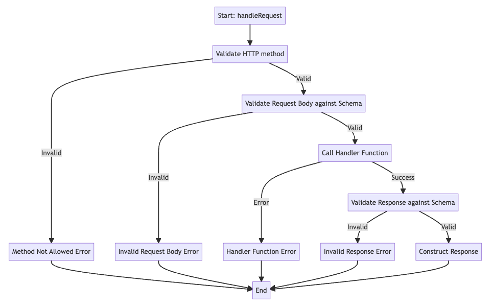

# AWS Lambda Request Package

The AWS Lambda Request package is a powerful tool designed to streamline the creation, validation, and handling of RESTful API requests within an AWS Lambda function. By including classes for request and response validation and encapsulating logic, it offers a reusable and testable framework for RESTful API development in AWS lambda. Moreover, it allows your code to automatically create the openapi spec for your application. Below you will find the installation instructions, features, usage examples, and additional support information.

## Installation

You can install the `aws-lambda-request` package via npm with the following command:

```bash
npm install aws-lambda-request
```

## Features

- **Encapsulated Logic**: The package encapsulates all logic needed for processing and responding to RESTful API requests, providing a cleaner codebase.
- **Reusable and Testable**: It offers a well-structured interface, enabling clean, reusable, and testable code.
- **Request and Response Validation**: With the `Schema` class, you can define and validate incoming requests and outgoing responses.
- **Method Type Checking**: The package handles HTTP method type checking, error handling, and default response headers, including CORS.
- **OpenAPI Schema Generation**: Allows for OpenAPI 3.0 compliant JSON schema generation, representing the REST request.

## Usage

### Defining Schemas with the Schema Class

The `Schema` class is used to define validation schemas for both request and response data. Schemas can be constructed with various field types.

```typescript
import { Schema, ValueField, FieldType } from 'aws-lambda-request';

const userSchema = new Schema({
  name: new ValueField(FieldType.String, true),
  age: new ValueField(FieldType.String, true),
});
```

### Handling Requests with the RestRequest Class

The `RestRequest` class is the core class used to process HTTP requests and responses, providing flexibility and structure to your API.

```typescript
import { RestRequest, Schema } from 'aws-lambda-request';

const requestSchema = new Schema({...});
const responseSchema = new Schema({...});

const restRequest = new RestRequest({
    namespace: "The Credit API",
    urlPath: "/some_url",
    methods: ['POST', 'GET'],
    schema: { request: requestSchema, response: responseSchema },
    handler: async (data) => { return processedData; }
});

const response = await restRequest.handle(requestInput);
```

### Generating OpenAPI Compliant Schemas

You can also generate an OpenAPI compliant JSON schema using the `jsonSchema` method:

```typescript
const openApiSchema = restRequest.jsonSchema();
```

## Example

An example use-case might be validating user creation in an API:

```typescript
import {
  RestRequest,
  Schema,
  ValueField,
  FieldType,
  DictField,
} from 'aws-lambda-request';

const requestSchema = new Schema({
  username: new ValueField(FieldType.String, true), // required
  password: new ValueField(FieldType.String, true), // reqired
  user_config: new DictField(
    {
      first_name: new ValueField(FieldType.String, false), // optional
      last_name: new ValueField(FieldType.String, false), // optional
    },
    false,
  ),
});

const responseSchema = new Schema({
  userId: new ValueField(
    FieldType.String,
    true,
    'The user id of the created user',
  ),
});

const createUserRequest = new RestRequest({
  namespace: 'User API',
  urlPath: '/create_user',
  methods: ['POST'],
  schema: { request: requestSchema, response: responseSchema },
  handler: async (data) => {
    // Logic to create user
    return { userId: 'some_user_id' };
  },
});

export async function handler(event: any) {
  return await createUserRequest.handle({
    method: 'POST',
    body: event.body || {},
    headers: event.headers || {},
  });
}
```

## Request handler process 



```mermaid_md
graph TD
    A[Start: handleRequest]
    B[Validate HTTP method]
    C[Validate Request Body against Schema]
    D[Call Handler Function]
    E[Validate Response against Schema]
    F[Construct Response]
    G[End]
    H[Method Not Allowed Error]
    I[Invalid Request Body Error]
    J[Handler Function Error]
    K[Invalid Response Error]

    A --> B
    B -->|Valid| C
    B -->|Invalid| H --> G
    C -->|Valid| D
    C -->|Invalid| I --> G
    D -->|Success| E
    D -->|Error| J --> G
    E -->|Valid| F
    E -->|Invalid| K --> G
    F --> G

```

## Support

For issues, feature requests, or general inquiries, please [open an issue](https://github.com/SaadAhmad123/aws-lambda-request/issues) on GitHub.

## License

This project is licensed under the [MIT License](https://github.com/SaadAhmad123/aws-lambda-request/blob/master/License.md). See the LICENSE file for details.
